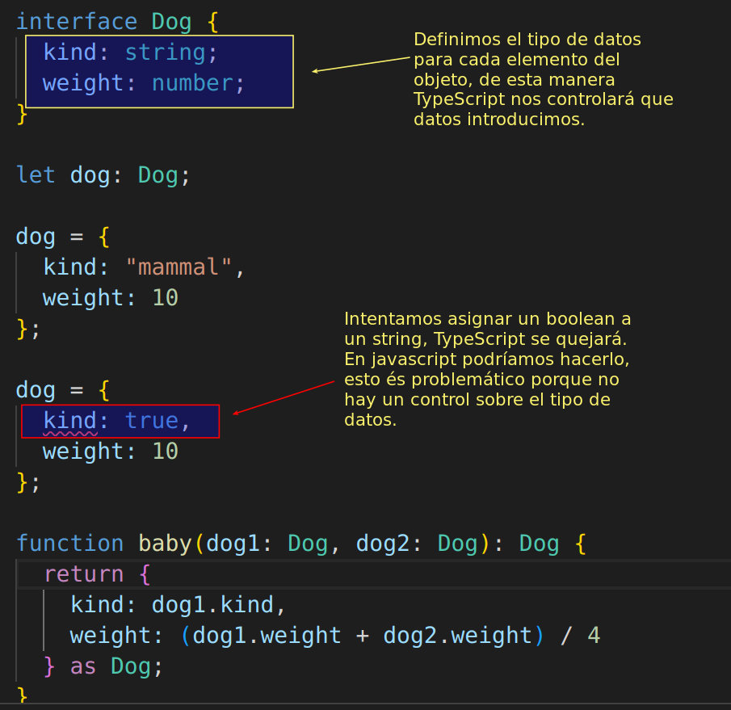
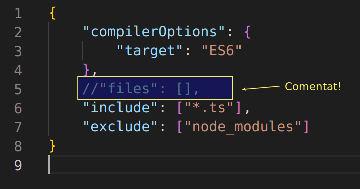

# Ejercicio 1 - Conocimiento TypeScript
## explica las principales ventajas que aporta el uso de TypeScript sobre JavaScript.
* La primera ventaja serà que en TypeScript definimos que tipo de datos serán utilizados.

## En esta tarea debes conseguir los ficheros resultado de las tareas realizadas en el video (first.ts, first.js, y tsconfig.json ), es posible que alguna de las opciones del tsconfig.json que se indican en el video ya no funcionen en tu versión de TypeScript ( te lo indicara el Visual Studio Code o tu Editor) , averigua cual es el problema y corrígelo.
Aquí tenemos dos opciones en el fichero de configuración de TS (tsconfig.json):
* O especificamos los archivos a compilar mediante la opción "files": ["aa.ts","bb.ts"]
* O especificamos en include todos los ficheros ts "include": ["*.ts"]

Has de escoger una de las dos opciones, una vez decidido la otra opción debe estar comentada, miramos el ejemplo donde quiero compilar todos los archivos "ts":
