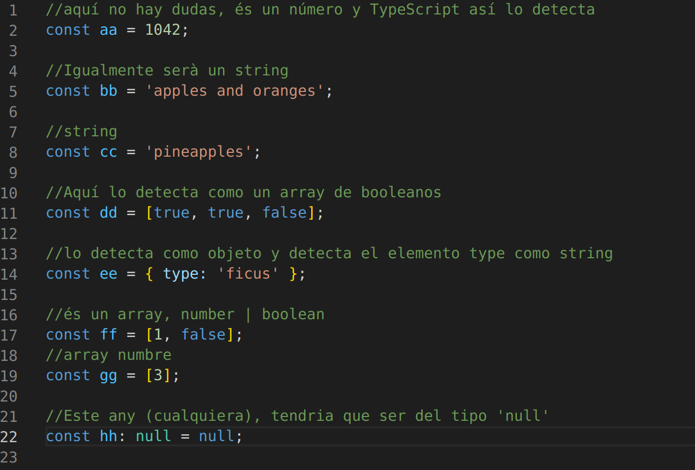

# 1. (1 punto) Para cada uno de los valores del fichero code2.ts, ¿Qué tipo de datos inferirá TypeScript? Explica por qué se ha inferido este tipo de datos.

# (1 punto) ¿Por qué se dispara cada uno de los errores del fichero code3.ts?

~~~
const i: 3 = 3;
i = 4; // Error TS2588 : Cannot assign to 'i' because it is a constant.ts(2588)
~~~
Este es el típico caso de intentar cambiar el valor de una constante, las constantes como indica la palabra
son valores constantes y no se pueden modificar.

~~~
const j = [1, 2, 3];
j.push(4);
j.push('5'); // Error TS2345: Argument of type '"5"' is not assignable to parameter of type 'number'.
~~~~
En este caso la constante j és un array de sólo números, entonces TypeScript así lo asigna "sólo numeros" para el array, cuando añadimos un número no hay problema, al añadir un texto '5' TypeScrip se quejará porque no sigue el patron numérico inicial.

~~~
let k: never = 4; // Error TSTS2322: Type '4' is not assignable to type 'never'.
~~~

El tipo never se usa para representar valores que nunca se supone que ocurran. Puede ser una función que siempre va a devolver un error o tiene un bucle infinito.

~~~
let l: unknown = 4;
let m = l * 2; // Error TS2571: Object is of type 'unknown'.
~~~
Al tener un tipo 'unknown' no podem operar directamente porque TypeScript no sabe de que tipo estamos hablando y no puede realizar la multiplicación, para hacerlo correctamente tendríamos que decirle que m es un número, aquí el ejemplo correcto:

~~~
let l: unknown = 4;
let m = l as number * 2; // Error TS2571: Object is of type 'unknown'.
~~~

# (0.5 puntos) ¿Cuál es la diferencia entre una clase y una interface en TypeScript?
* Una interface es como una plantilla con las propiedades y métodos sin desarrollar, símplemente son 
las definiciones de lo que esa interfaz accepta.
* La classe és un conjunto de propiedades y métodos desarrollados.

Vamos a ver un ejemplo:

~~~
import { isTemplateExpression } from "typescript";

//Aquí declarem la interface "tema" que serà una plantilla del contingut relacionat amb un tema musical
//Podem observar que no desenvolupem els mètodes, símplement els definim.

interface tema {
    titulo: string;
    grupo: string;
    duracion: number;
    estilo: string;
    reproducir(): void;
    pausar(): void;
  }

//La classe "Cancion" es implementa la plantilla "tema"
//Aquí si desenvolupem elsmètodes, etc.

  class Cancion implements tema {
    titulo: string;
    grupo: string;
    duracion: number;
    estilo: string;

    constructor(titulo: string, grupo: string, duracion: number, estilo: string){
        this.titulo = titulo;
        this.grupo = grupo;
        this.duracion = duracion;
        this.estilo = estilo;
    }
    reproducir(): void {
        console.log(`reproduciendo: ${this.titulo}`);
    }
    pausar(): void {
        console.log(`pausada la canción ${this.titulo}`);
    }
}

const cancion = new Cancion("One in a million","Level 42",3.5,"Funk");
cancion.reproducir();
~~~
