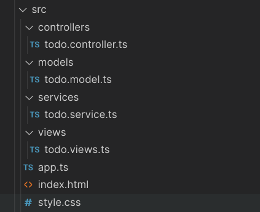
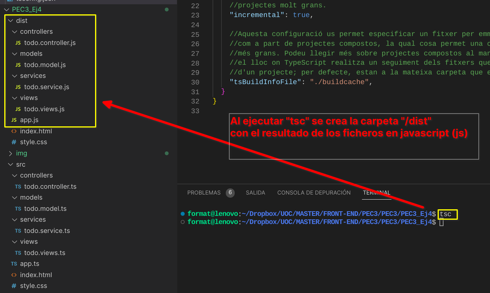
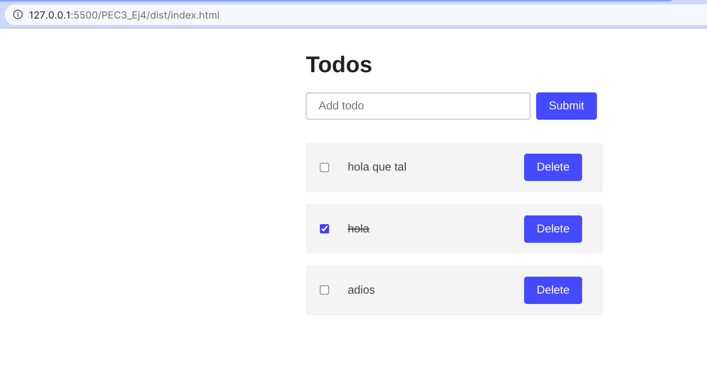

# Los comandos que se han de ejecutar para transpilar y ejecutar la aplicación.
## Tenemos que configurar el archivo **tsconfig.json** en la raíz de nuestro proyecto
~~~
{
  "compilerOptions": {

    //Aquí definim amb quina versió de javascript volem el resultat
    "target": "es2015", 

    //Aquesta opció estableix el sistema de mòduls que s'utilitzaran en els arxiuscompilats ".js"
    "module": "commonjs",
    
    //Directori de sortida del fitxer js compilat
    "outDir": "./dist",

    //Carpeta on estan els fitxers inicials amb el codi nostre
    "rootDir": "./src",

    //L'opció estricta sotmetrà el vostre codi a regles més estrictes en termes de comprovació de tipus estàtic. 
    //Més estricte vol dir més segur, així que està bé.
    "strict": true,
    
  }
}
~~~
## Crear la carpeta **/src**
Dentro de la carpeta **/src** vamos a realizar nuestros archivos con el código fuente en TypeScript, todos ellos con la extensión **ts**
Aquí podemos ver la estructura de carpetas y ficheros de la carpeta **/src**

## Ejecutar el traspilador **tsc*
Una vez realizado todo el trabajo, desde el terminal en la carpeta raiz de nuestro proyecto ejecutamos **tsc**

## Ver el resultado
En este caso copiamos los ficheros **index.html**y **style.css**, desde vscode abrimos el servidor virtual sobre el archivo index.htm y veremos el resultado.

